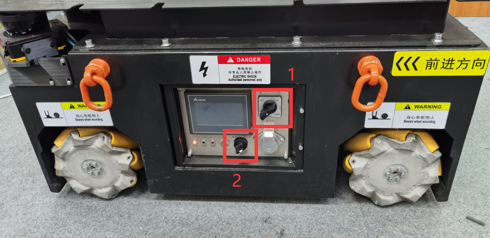
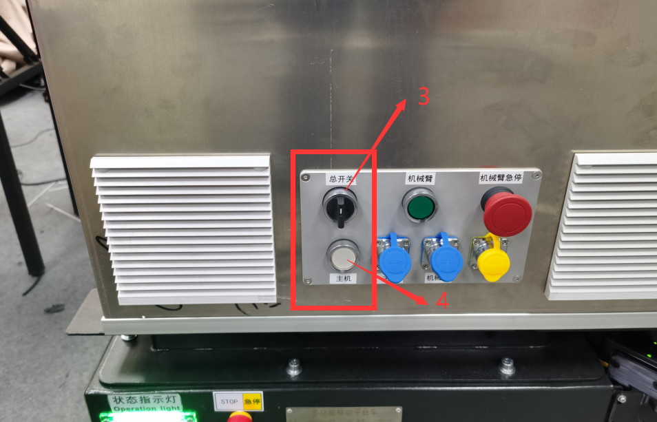
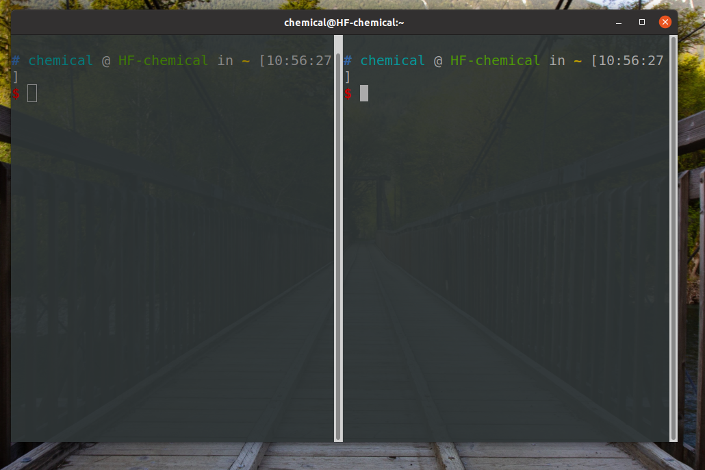
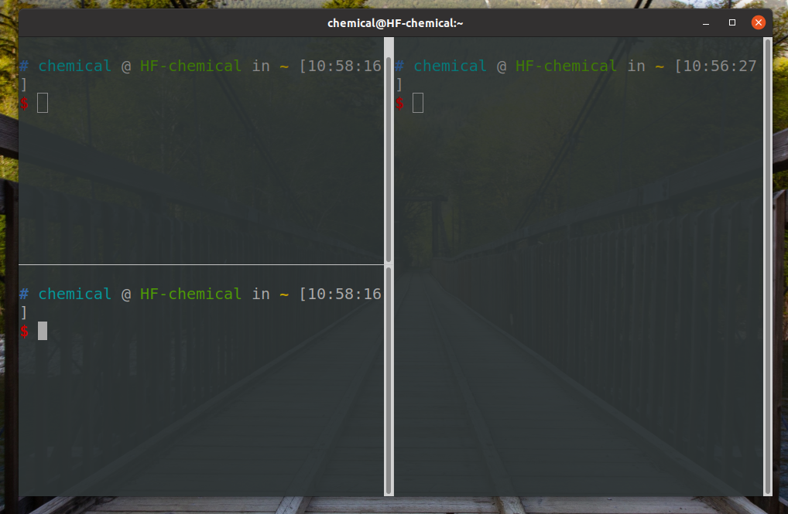
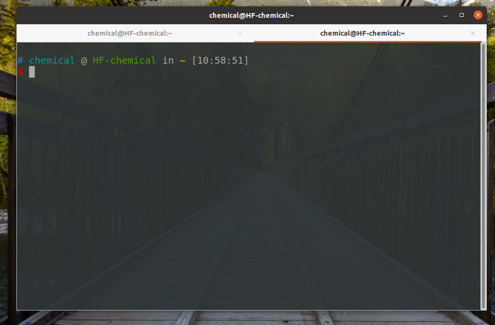
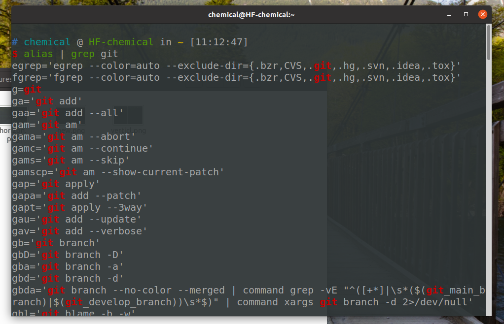

<!-- TOC -->

- [航发平台架构说明](#%E8%88%AA%E5%8F%91%E5%B9%B3%E5%8F%B0%E6%9E%B6%E6%9E%84%E8%AF%B4%E6%98%8E)
  - [系统开机](#%E7%B3%BB%E7%BB%9F%E5%BC%80%E6%9C%BA)
  - [代码架构](#%E4%BB%A3%E7%A0%81%E6%9E%B6%E6%9E%84)
    - [系统初始化](#%E7%B3%BB%E7%BB%9F%E5%88%9D%E5%A7%8B%E5%8C%96)
    - [自动充电](#%E8%87%AA%E5%8A%A8%E5%85%85%E7%94%B5)
    - [建图](#%E5%BB%BA%E5%9B%BE)
    - [导航](#%E5%AF%BC%E8%88%AA)
    - [标点和实验演示](#%E6%A0%87%E7%82%B9%E5%92%8C%E5%AE%9E%E9%AA%8C%E6%BC%94%E7%A4%BA)
  - [附录](#%E9%99%84%E5%BD%95)
    - [终端快捷键](#%E7%BB%88%E7%AB%AF%E5%BF%AB%E6%8D%B7%E9%94%AE)
    - [git 快捷键](#git-%E5%BF%AB%E6%8D%B7%E9%94%AE)

<!-- /TOC -->
# 航发平台架构说明

> **项目地址**: https://git.lug.ustc.edu.cn/speedzjy/chemical_robot_ws （未对外开放）
> 
> **主机代码位置**: /home/chemical/speed/chemical_robot_ws
> 
> **主机配置**: i7-11700 @ 2.50GHz x 16 + GTX1660Ti
> 
> **系统**: Ubuntu20.04 + ROS noetic
> 
> **主机名**: HF-chemical
> 
> **用户名**: chemical
> 
> **密码**: dd
>  
> **root 密码**: dd
> 
> **有线内网 ip**: 192.168.101.10 (与激光雷达连接，不要更改) 
>  
> **前雷达 ip**: 192.168.101.9 | **后雷达 ip**: 192.168.101.8
>  
> **VSCode gist**: e9957d41932238a8671d9d761db0b1f6


## 系统开机


 
将旋钮 **1**  打向右侧将平台整机上电；旋钮 **2** 切换遥控通讯和串口通讯，暂时不拧，默认在左侧。



将旋钮 **3**  打向上将平台主机和机械臂上电，按下开关 **4** 开启主机。

---

## 代码架构

### 系统初始化

- 将旋钮 **2** 打向右侧。

- `roslaunch communication_rs485 platform_init.launch`

这一步初始化了底层控制节点以及激光雷达驱动。

每次运行初始化节点将平台里程计计数**置零**。

**Subscribed Topics** 
- **None**


**Published Topics**
- odom (nav_msgs/Odometry) **轮速里程计**
- scan_full (sensor_msgs/LaserScan) **点云**
- hf_platform/joy_vel (geometry_msgs/Twist) **手柄遥控速度**
- hf_platform/nav_vel (geometry_msgs/Twist) **导航速度**
- hf_platform/twist_mux/cmd_vel (geometry_msgs/Twist) **下168.2.10 、速度信息**


**手柄遥控**： 
- **按住** **RB** 使能，左摇杆控制前后左右，右摇杆控制旋转。右摇杆打向左半区为逆时针旋转，打向右半区为顺时针旋转。
- 遥控速度优先级大于导航速度优先级，一旦手柄介入，平台由手柄全权控制。按一下 **LB** 键释放手柄控制权。


<hr style="height:1px;border:none;border-top:1px solid #808080;" />

### 自动充电

初始化完毕后，可以进行自动充电。将速度信息里 **twist.angular.x** 置为 **1** 即发出自动充电信号。

**平台目前处于开发阶段，开发阶段自动充电流程示例**:
+ 命令控制
  - 用遥控将平台对准自动充电桩，按一下 **LB** 键释放遥控控制权。
  - 运行`rostopic pub -r 20 /hf_platform/nav_vel geometry_msgs/Twist '{linear: {x: 0, y: 0, z: 0}, angular: {x: 1, y: 0, z: 0}}'`
+ **手柄控制**
  - 用遥控将平台对准自动充电桩，按住 **RB** 键的同时按住 **A** 键开启充电。之后，先松开 **RB** ，再松开 **A** 键，充电命令将保存进底盘，可以持续充电。

<hr style="height:1px;border:none;border-top:1px solid #808080;" />

### 建图

建图算法使用 karto 图优化建图算法。建图前请按手柄 **X** 键将里程计**置零**。

- `roslaunch hf_karto hf_karto.launch`

保存地图：

```
rosrun map_server map_saver -f /home/chemical/speed/chemical_robot_ws/src/slam/hf_nav/hf_navigation/saved_map/hf_map
```

<hr style="height:1px;border:none;border-top:1px solid #808080;" />

### 导航

导航算法目前使用 amcl 定位与 move_base 规划器, 规划算法使用 eband。导航前请按手柄 **X** 键将里程计**置零**。

- `roslaunch hf_navigation hf_navigation.launch`

<hr style="height:1px;border:none;border-top:1px solid #808080;" />

### 标点和实验演示

按照程序提示即可标点, 标点前要打开导航
- `rosrun task_communication hf_record_pose_node`

这个节点接收 task_manager 下发的导航命令, 并发布反馈信息

- `rosrun task_communication task_communication_node` 

 
<hr style="height:1px;border:none;border-top:1px solid #808080;" />

## 附录
 
主机开启有线内网连接时，无线网络只能远程通信，但不能访问外网。**主机关闭有线内网连接，无线网络才可上网**。由于激光雷达连接有线内网，运行机器人时请打开有线内网。

命令行 shell 使用 zsh 。 修改环境变量请编辑 `~/.zshrc`，ROS工作空间环境变量请 `source devel/setup.zsh`

### 终端快捷键
- `ctrl + shift + o` 垂直分割终端
- `ctrl + shift + h` 水平分割终端
- `ctrl + shift + t` 同一终端新建标签页

示例:

> 垂直分割
> 
> 
> 
> 水平分割
> 
> 
> 
> 新建标签页
> 
> 

### git 快捷键

> 命令 `alias | grep git` 可以列出所有别名
> 
> 